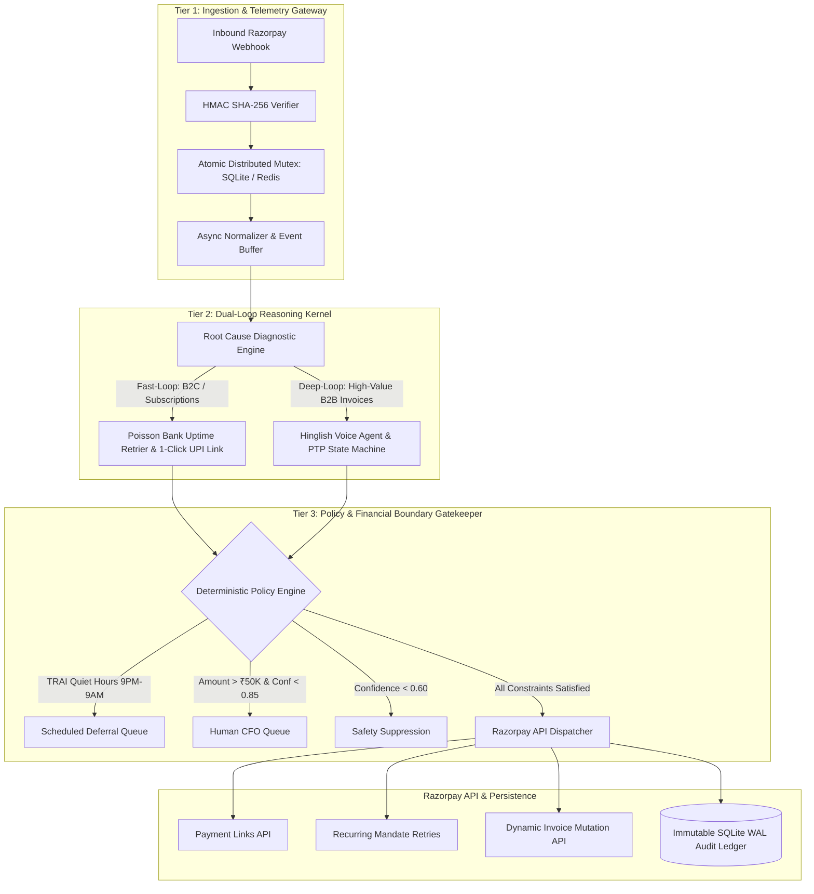

# ARCHITECTURE SPECIFICATION: RazorRevive-OS

> **Track 03:** AI Revenue Recovery — Razorpay AI Buildathon 2026  
> **System Architecture Version:** 1.0.0 (Production-Grade)

---

## 1. System Overview

**RazorRevive-OS** is an autonomous, dual-loop revenue recovery and mandate orchestration engine designed to prevent and recover lost gross merchandise value (GMV) across digital payments, failed recurring subscriptions, and overdue B2B invoices.

The architecture enforces a **Three-Tier Financial Isolation Boundary Pattern**, ensuring that probabilistic LLM reasoning is strictly segregated from deterministic state execution, financial mutations, and regulatory compliance rules.



---

## 2. The Three-Tier Financial Boundary Pattern

### Tier 1: Ingestion & Telemetry Gateway
* **HMAC SHA-256 Webhook Verification:** Validates every incoming payload signature against the merchant webhook secret before any processing.
* **Distributed Atomic Mutex:** Acquires an atomic lock on `(merchant_id + payment_id)` with TTL to guarantee strict idempotency. Duplicate or out-of-order webhook replays are acknowledged with HTTP 200 and ignored.
* **Telemetry Aggregator:** Continuously ingests issuing bank health metrics to identify systemic degradation (e.g. HDFC 503 gateway drops).

### Tier 2: Dual-Loop Structured Reasoning Kernel
* **Fast-Loop (B2C & Subscriptions):** Classifies failure codes into Transient Bank Outages, Insufficient Balances, Expired Tokens, or Abandoned 2FA Sessions. Uses a Poisson arrival model to calculate the optimal retry timestamp $T_{\text{target}}$.
* **Deep-Loop (High-Ticket B2B Invoices > ₹25,000):** Engages client finance teams via low-latency conversational voice. Handles dispute objections (e.g., GST invoice mismatch) by dynamically mutating invoices via Razorpay APIs and locking a Promise-to-Pay (PTP) auto-debit timestamp.

### Tier 3: Deterministic Policy & Execution Gatekeeper
* Pure deterministic Python/Pydantic validation layer.
* Enforces TRAI contact quiet hours (9:00 PM – 9:00 AM IST), maximum 3-retry caps, dynamic discount caps (<10% or ₹500), and auto-escalates high-value transactions (>₹50,000) with confidence < 0.85 to human review.

---

## 3. Threat Model & Mitigation Matrix

| Threat Vector | Real-World Risk | Architectural Mitigation |
| :--- | :--- | :--- |
| **Webhook Replay Storms** | Duplicate payment links or double debit attempts when bank gateways retry webhooks. | **Atomic Distributed Mutex:** SQLite/Redis distributed lock with monotonic timestamp check rejects replays instantly. |
| **Thundering Herd on Bank Outage** | 100 failed transactions simultaneously retrying when bank servers reboot, causing instant re-failure. | **Exponential Backoff with Full Decorrelated Jitter:** Spreads retries across a Poisson distribution window. |
| **LLM Monetary Hallucination** | LLM generating unapproved discounts, altered amounts, or fake refund triggers. | **Strict Pydantic v2 Schema Enforcement:** Amount fields are immutable and passed directly from verified webhook payloads; discounts are clamped by hardcoded boundary rules. |
| **Regulatory & TRAI Violations** | Outbound messages sent to customers during late-night hours causing customer complaints. | **Deterministic Time-Window Gate:** Any outbound SMS/WhatsApp triggered between 21:00 and 09:00 IST is automatically deferred to 09:05 IST queue. |
| **Cascading Gateway 5xx Failures** | Razorpay or SMS APIs experiencing downtime. | **Stateful Circuit Breaker:** After 5 consecutive 5xx errors, enters `DEGRADED_MODE`, queues events to a local Dead-Letter Queue (DLQ), and alerts operators. |

---

## 4. State Machine Specification

```
[WEBHOOK_RECEIVED]
       │
       ▼
[SIGNATURE_VALIDATED] ──(Invalid)──► [HTTP 400 REJECT]
       │ (Valid)
       ▼
[IDEMPOTENCY_LOCK_ACQUIRED] ──(Duplicate)──► [HTTP 200 IDEMPOTENT_IGNORED]
       │ (Locked)
       ▼
[DIAGNOSING_ROOT_CAUSE]
       │
       ▼
[POLICY_BOUNDARY_CHECK]
       ├── (Quiet Hours) ──────────► [DEFERRED_QUEUE (09:05 IST)]
       ├── (Amount > ₹50K & Low Conf) ► [ESCALATED_HUMAN_QUEUE]
       ├── (Confidence < 0.60) ────► [SUPPRESSED]
       └── (Passed All Gates) ─────► [EXECUTING_INTERVENTION]
                                            │
                                            ▼
                               [RAZORPAY_API_DISPATCHED]
                                            │
                                            ▼
                               [AUDIT_LEDGER_COMMITTED]
```

---

## 5. Persistence & Audit Logging Specification

Every lifecycle event is recorded in an immutable SQLite database operating in **Write-Ahead Logging (WAL) mode**:

```sql
CREATE TABLE IF NOT EXISTS recovery_events (
    event_id TEXT PRIMARY KEY,
    payment_id TEXT NOT NULL,
    timestamp REAL NOT NULL,
    error_code TEXT NOT NULL,
    failure_category TEXT NOT NULL,
    confidence_score REAL NOT NULL,
    policy_checks_passed INTEGER NOT NULL,
    action_taken TEXT NOT NULL,
    recovery_status TEXT NOT NULL,
    api_response_payload TEXT,
    created_at DATETIME DEFAULT CURRENT_TIMESTAMP
);

CREATE TABLE IF NOT EXISTS idempotency_keys (
    key TEXT PRIMARY KEY,
    merchant_api_key_id TEXT DEFAULT 'default_tenant',
    payload_hash TEXT,
    created_at REAL NOT NULL,
    status TEXT NOT NULL
);
CREATE INDEX IF NOT EXISTS idx_idem_merch ON idempotency_keys(merchant_api_key_id, key);

CREATE TABLE IF NOT EXISTS audit_chain_ledger (
    event_id TEXT PRIMARY KEY,
    merchant_api_key_id TEXT DEFAULT 'default_tenant',
    sequence_id INTEGER NOT NULL,
    timestamp REAL NOT NULL,
    event_type TEXT NOT NULL,
    payload_json TEXT NOT NULL,
    prev_hash TEXT NOT NULL,
    current_hash TEXT NOT NULL
);
CREATE INDEX IF NOT EXISTS idx_audit_merch ON audit_chain_ledger(merchant_api_key_id, sequence_id);

CREATE TABLE IF NOT EXISTS b2b_invoices (
    invoice_id TEXT PRIMARY KEY,
    customer_id TEXT NOT NULL,
    amount REAL NOT NULL,
    gstin TEXT NOT NULL,
    status TEXT NOT NULL,
    dispute_reason TEXT,
    ptp_timestamp REAL,
    last_updated REAL NOT NULL
);

CREATE TABLE IF NOT EXISTS ptp_ledger (
    ptp_id TEXT PRIMARY KEY,
    invoice_id TEXT NOT NULL,
    customer_id TEXT NOT NULL,
    promised_timestamp REAL NOT NULL,
    mandate_scheduled INTEGER NOT NULL,
    status TEXT NOT NULL
);
```

---

## 6. NPCI Switch Telemetry & Dynamic Hazard Adaptation

RazorRevive-OS ingests live NPCI switch health telemetry and major issuing bank gateway signals (`HDFC`, `SBI`, `ICICI`, `AXIS`, `KOTAK`, `PNB`, `YESB`):

1. **Telemetry Feed (`NPCISwitchTelemetryEngine`):** Tracks realtime switch states (`HEALTHY`, `DEGRADED`, `OUTAGE`), average latency, success rates, and active error codes (e.g. `UPI_U30_DEGRADATION`).
2. **Dynamic Weibull Modulation:** When a banking rail experiences degradation, the recovery optimizer shifts Weibull hazard parameters ($k, \lambda$) to calculate dynamically delayed optimal retry windows ($T_{\text{optimal}}$), preventing destructive hammering of degraded bank nodes.
3. **Local Circuit Breakers:** If bank success rates drop below 50% or latency exceeds 3000ms, the switch enters `OUTAGE` tripping the circuit breaker and routing transactions immediately to alternative payment rails (e.g. RuPay / Netbanking fallback).

---

## 7. Card Network Token Lifecycle State Machine

Compliant with RBI Card-on-File Tokenization (CoFT) guidelines:

* **Networks Supported:** Visa Token Service (VTS), Mastercard Digital Enablement Service (MDES), RuPay Tokenization.
* **Token States:** `ACTIVE`, `SUSPENDED`, `REVOKED`, `CRYPTOGRAM_EXPIRED`, `DELETED`.
* **Automated Remediation Workflows:**
  * `CRYPTOGRAM_EXPIRED`: Automated API call to card network token service to reprovision dynamic cryptogram without customer disruption.
  * `SUSPENDED`: Dispatches step-up 2FA consent link.
  * `REVOKED` / `DELETED`: Fallback 1-click UPI intent recovery.

---

## 8. Enterprise Bulk CSV Batch Processor

For enterprise merchant finance teams reconciling hundreds of failed transactions simultaneously:

* **Vector Diagnostic Engine:** Processes 100+ CSV payment failure rows in $< 5\text{ms}$ total compute time.
* **Batch Policy Validation:** Evaluates TRAI quiet hours, retry ceilings, and financial caps per item deterministically.
* **Exportable Resolution Action Plans:** Outputs structured CSVs with recommended retry schedules, 1-click payment links, and audit trace IDs.

---

## 9. Telephony & Voice Agent Bridge Architecture

For enterprise B2B receivables negotiation in production telephony environments:

```
[Customer / Accounts Payable Contact]
                  │ (Voice Audio via WebRTC / SIP)
                  ▼
[Telephony Gateway (Exotel / Twilio / Tata Tele)]
                  │ (Bi-directional Audio Stream / WebSocket)
                  ▼
[ASR Transcriber (Whisper / Local Speech Engine)]
                  │ (Transcript JSON)
                  ▼
[RazorRevive-OS Hinglish Intent Extractor & State Machine]
                  │ (MutationProposal / PTP Decision)
                  ▼
[Deterministic Policy Engine Boundary]
                  │ (Clamped Speech Response)
                  ▼
[TTS Synthesizer (Bark / Local Speech Synth)]
                  │ (Audio Buffer)
                  ▼
[Telephony Gateway -> Customer Ear]
```

* **Hinglish Intent Extraction:** Recognizes commercial payment terms (`"Galat GSTIN"`, `"Next Friday payment kar denge"`, `"UTR reference number ICIC9821034"`, `"Section 194J 10% TDS deduction"`).
* **Zero-Hallucination Clamp:** AI can only mutate invoices within predefined merchant credit limit bounds and standard GSTIN validation algorithms.

---

## 10. Multi-Tenant Tenant Isolation & Security

* **Tenant Keying (`merchant_api_key_id`):** Every idempotency key, audit event, and state machine session is partitioned by `merchant_api_key_id`.
* **Sub-Millisecond Redis Fallback:** Redis mutex connections operate with a 0.15s socket timeout, falling back seamlessly to local SQLite WAL mode without latency spikes.
* **Hash-Chained Cryptographic Ledgers:** Independent Merkle-linked audit streams per tenant guarantee verifiable mathematical integrity from Genesis to Head.

