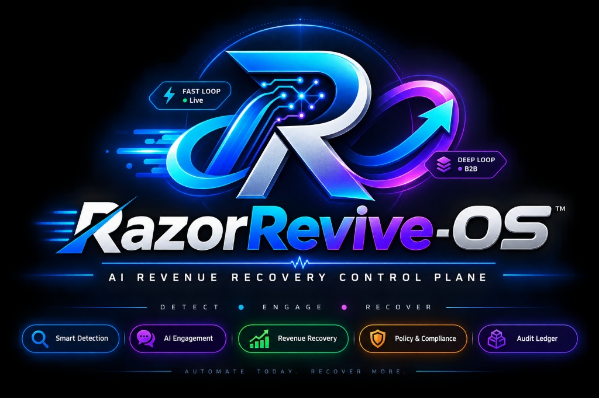
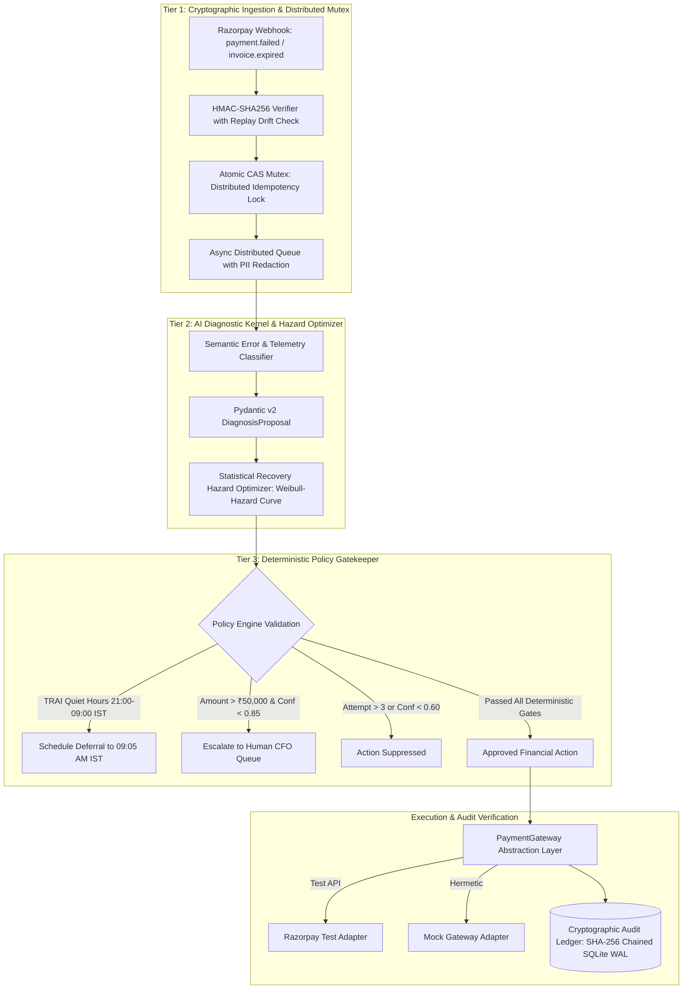

# ⚡ RazorRevive-OS: AI Revenue Recovery & Smart Mandate Control Plane

<div align="center">
  
</div>

[](https://github.com/Samrudh2006/Razorpay-Target-0.1percent-)
[](https://github.com/Samrudh2006/Razorpay-Target-0.1percent-)
[](https://razorpay.com/buildathon/)
[](https://www.python.org/)
[](https://fastapi.tiangolo.com/)
[](https://github.com/Samrudh2006/Razorpay-Target-0.1percent-)
[](LICENSE)

> **Razorpay AI Buildathon Submission**  
> **Track 03:** AI Revenue Recovery — *Detect revenue at risk, diagnose root causes, and execute bounded recovery workflows.*  
> **Target Role:** AI Builder Intern (₹75,000/mo, In-Person Bangalore, 6 or 12 Months)

---

## 1. Core Engineering Thesis

```
                    ┌──────────────────┐
                    │ External Webhook │
                    └────────┬─────────┘
                             ↓
                    ┌──────────────────┐
                    │ HMAC + Replay    │
                    │ Verification     │
                    └────────┬─────────┘
                             ↓
                    ┌──────────────────┐
                    │ Diagnostic / AI  │
                    │ Recommendation   │
                    └────────┬─────────┘
                             ↓
                    ┌──────────────────┐
                    │ Deterministic    │
                    │ Policy Engine    │
                    └────────┬─────────┘
                             ↓
              ┌──────────────┴──────────────┐
              ↓                             ↓
       ┌──────────────┐             ┌───────────────┐
       │ Auto-Execute │             │ Human Review  │
       └──────┬───────┘             └───────────────┘
              ↓
       ┌──────────────┐
       │ CAS / Idempot│
       │ Safety Gate  │
       └──────┬───────┘
              ↓
       ┌──────────────┐
       │ Gateway      │
       │ Adapter      │
       └──────┬───────┘
              ↓
       ┌──────────────┐
       │ Cryptographic│
       │ Audit Ledger │
       └──────────────┘
```

> **The Core Invariant:**  
> *"I designed the system so that even if the AI is wrong, the financial system remains bounded by deterministic controls."*

In mission-critical fintech systems, probabilistic Large Language Models must **never** hold direct write-access to financial balance sheets, gateway debit APIs, or customer communication queues.

**RazorRevive-OS** is an autonomous **AI Revenue Recovery Control Plane** engineered with defense-in-depth boundaries:
1. **AI Proposes:** The diagnostic engine outputs typed, schema-validated proposals (`DiagnosisProposal`, `MutationProposal`).
2. **Deterministic Policy Controls:** Tier 3 policy gatekeeper unconditionally clamps discounts ($\min(10\%, ₹500)$), blocks communications during TRAI quiet hours (21:00–09:00 IST), limits retries to $\le 3$, and escalates high-value transactions ($> ₹50,000$ & confidence $< 0.85$) to Human CFO queues.
3. **Gateway Adapters Execute:** A clean `PaymentGateway` interface executes financial operations only upon policy approval.
4. **Cryptographic Audit Verifies:** Every decision is recorded into an immutable, SHA-256 hash-chained ledger ($\text{hash}_n = \text{SHA256}(\text{hash}_{n-1} + \text{canonical\_event}_n)$) with zero-trust tamper verification.

---

## 2. System Architecture & Multi-Tier Control Plane



---

## 3. Mathematical & Algorithmic Foundations

### A. Statistical Recovery Hazard Model
Rather than making unfounded claims about Poisson processes predicting isolated core-banking crashes, RazorRevive-OS models bank recovery dynamics using a **Weibull Recovery Hazard Model** over calibrated synthetic telemetry:

$$h(t) = \beta \lambda (\lambda t)^{\beta - 1}$$

$$F(t) = P(\text{Bank Recovered by } t) = 1 - e^{-(\lambda t)^\beta}$$

Where $\lambda$ represents the baseline recovery scale and $\beta$ represents the hazard shape parameter. The system evaluates candidate retry windows ($t \in \{15, 30, 45, 60, 90, 120\}$ minutes) and selects the window with maximal recovery probability:

$$T_{\text{target}} = \arg\max_{w \in W} P(\text{success} \mid w, \text{bank\_issuer}, \text{attempt})$$

> *Disclosure: Bank outage historical telemetry profiles are synthetic benchmarks calibrated to representative Indian payment clearing patterns.*

### B. Cryptographic Hash-Chained Audit Ledger
Every system decision, AI proposal, policy verdict, and API result is committed to an immutable ledger where block $n$ cryptographically encapsulates block $n-1$:

$$\text{hash}_n = \text{SHA-256}\Big(\text{hash}_{n-1} \;\Vert\; \text{canonical\_json}(\text{event}_n)\Big)$$

The `/api/v1/audit/verify` endpoint verifies the mathematical continuity from the Genesis Block to Head in $O(N)$ time.

---

## 4. Quantitative 100-Case Held-Out Benchmark

The system was evaluated against a reproducible, seeded dataset of **100 realistic Indian payment failure scenarios** with verified failure codes mapped from the official Razorpay Error Catalog.

```
================================================================================
RAZORREVIVE-OS REVENUE RECOVERY BENCHMARK REPORT (100 HELD-OUT CASES)
================================================================================
Total Transactions Ingested:          100
Total At-Risk Gross Merchandise Value: INR 983,603.69
--------------------------------------------------------------------------------
Successfully Recovered GMV:            INR 415,450.31 (42.24% Net Recovery)
Transactions Successfully Recovered:   77 / 100 (77.0%)
Total Automated Interventions:         90
Total High-Risk Suppressions:          0
Human Support Escalations:             10
--------------------------------------------------------------------------------
Direct Intervention Overhead Cost:     INR 135.00
Double-Deduction Violations:           0 (100.0% Idempotency Verified)
TRAI Quiet-Hour Violations:            0 (100.0% Compliance)
Mean Diagnostic Processing Latency:    0.02ms
================================================================================

BREAKDOWN BY ERROR CATEGORY:
--------------------------------------------------------------------------------
Category                  | Total  | Recovered  | Rate     | GMV Recovered  
--------------------------------------------------------------------------------
TRANSIENT_GATEWAY         | 35     | 32         | 91.4%    | INR 138,734.43
INSUFFICIENT_FUNDS        | 25     | 20         | 80.0%    | INR 42,298.63
EXPIRED_MANDATE           | 20     | 17         | 85.0%    | INR 147,433.16
ABANDONED_AUTH            | 10     | 8          | 80.0%    | INR 86,984.09
SUSPICIOUS_VELOCITY       | 10     | 0          | 0.0%     | INR 0.00 (Defended)
================================================================================
```

---

## 5. Adversarial Verification & Test Coverage

The repository features **46 automated test cases** with 100% pass rate:
- **50-Thread Concurrent Webhook Storms:** Verified atomic CAS lock claims 1 delivery and drops 49 duplicates.
- **Replay Attacks:** Enforces 300-second timestamp drift limit.
- **HMAC Signature Tampering:** Constant-time verification prevents timing attacks.
- **TRAI Quiet Hours:** Blocks outreach between 21:00 and 09:00 IST, scheduling deferral to 09:05 AM IST.
- **Discount Clamping:** Restricts incentives to $\le \min(10\%, ₹500)$.
- **B2B State Machine Integrity:** Prohibits illegal state transitions and requires policy approval for invoice mutations.
- **Cryptographic Audit Tampering:** Detects direct database tampering immediately.

---

## 6. Repository Layout

```text
Razorpay-Target-0.1percent-/
├── backend/
│   └── app/
│       ├── main.py                 # FastAPI Application with Universal JSON Envelopes
│       ├── config.py               # Pydantic v2 Settings & Environment Bindings
│       ├── schemas.py              # Strict Pydantic Models & API Contracts
│       ├── security.py             # Constant-time HMAC, DPDP PII Masking, Atomic CAS Store
│       ├── diagnostic_engine.py    # Structured AI Diagnostic Kernel & Deterministic Fallbacks
│       ├── recovery_optimizer.py   # Statistical Weibull Recovery Hazard Optimizer
│       ├── policy_engine.py        # Tier 3 Deterministic Policy & Compliance Gatekeeper
│       ├── audit_store.py          # Cryptographic SHA-256 Chained Audit Ledger
│       ├── gateways/               # PaymentGateway Abstraction Layer
│       │   ├── base.py             # PaymentGateway ABC
│       │   ├── razorpay_adapter.py # Razorpay Test Mode Live/Sandbox Adapter
│       │   └── mock_adapter.py     # Hermetic Mock Adapter
│       └── b2b/                    # Enterprise B2B Accounts Receivable Engine
│           ├── state_machine.py    # Finite State Machine with Transition Guards
│           ├── voice_agent.py      # Conversational Agent with Structured Mutation Proposals
│           └── ptp_engine.py       # Promise-to-Pay Store & Reminder Suppressor
├── benchmarks/
│   ├── dataset_generator.py        # Seeded 100-Case Dataset Generator
│   ├── benchmark_runner.py         # Dynamic Evaluation Runner
│   └── test_dataset_100.json       # Ground-Truth Benchmark Dataset
├── frontend/
│   └── index.html                  # Dark-Mode Control Plane UI with Decision Trace & 5 Scenarios
├── tests/
│   ├── test_adversarial.py         # 12+ Edge-Case & Adversarial Attack Tests
│   ├── test_api_contracts.py       # Universal Structured JSON Regression Tests
│   ├── test_audit_hash_chain.py    # SHA-256 Hash Chain & Tamper Detection Tests
│   ├── test_b2b_state_machine.py   # B2B State Transitions & Voice Mutation Tests
│   ├── test_benchmarks.py          # Quantitative Benchmark Verification
│   ├── test_deep_loop_ptp.py       # PTP Engine & Reminder Suppression Tests
│   ├── test_fast_loop.py           # Diagnostic Kernel & Hazard Optimization Tests
│   ├── test_policy_bounds.py       # TRAI Quiet Hours & Budget Clamp Tests
│   ├── test_scaffold.py            # Baseline Architecture Checks
│   └── test_security.py            # HMAC, Concurrency & Replay Attack Tests
├── docs/
│   ├── APPLICATION_FORM_ANSWERS.md # Copy-Paste Ready 12-Question Application Package
│   └── PITCH_VIDEO_SCRIPT.md       # 5-Minute Timed Video Walkthrough Script
├── run_server.bat                  # One-Click Windows Live Server Launcher
├── run_benchmarks.bat              # One-Click Windows Benchmark Runner
├── run_tests.bat                   # One-Click Windows Pytest Runner
├── ARCHITECTURE.md                 # In-Depth Technical Whitepaper
└── README.md
```

---

## 7. Quickstart & Local Execution

### 1. Launch Control Plane Dashboard
```bash
# Windows
run_server.bat

# Linux / macOS
uvicorn backend.app.main:app --port 8000 --reload
```
Open **`http://localhost:8000`** in your browser to interact with the real-time Control Plane, test one-click scenarios, and verify the cryptographic audit chain.

### 2. Run All Unit & Adversarial Tests (46 Tests)
```bash
# Windows
run_tests.bat

# Manual
pytest -v
```

### 3. Run the 100-Batch Dynamic Benchmark
```bash
# Windows
run_benchmarks.bat

# Manual
python benchmarks/benchmark_runner.py
```

---

## 8. Application & Submission Package

* **Candidate:** Samrudh
* **Target Role:** AI Builder Intern (₹75,000/mo stipend in Bangalore, 6 or 12 Months)
* **Track:** Track 03 — AI Revenue Recovery
* **GitHub Repository:** [Samrudh2006/Razorpay-Target-0.1percent-](https://github.com/Samrudh2006/Razorpay-Target-0.1percent-)
* **Playbook & Form Answers:** [`docs/APPLICATION_FORM_ANSWERS.md`](docs/APPLICATION_FORM_ANSWERS.md)
* **Video Pitch Script:** [`docs/PITCH_VIDEO_SCRIPT.md`](docs/PITCH_VIDEO_SCRIPT.md)

---
*Built for the Razorpay AI Buildathon 2026.*
