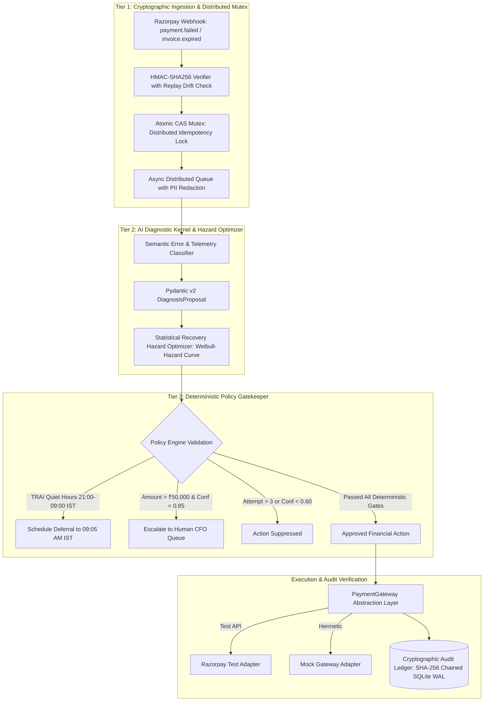
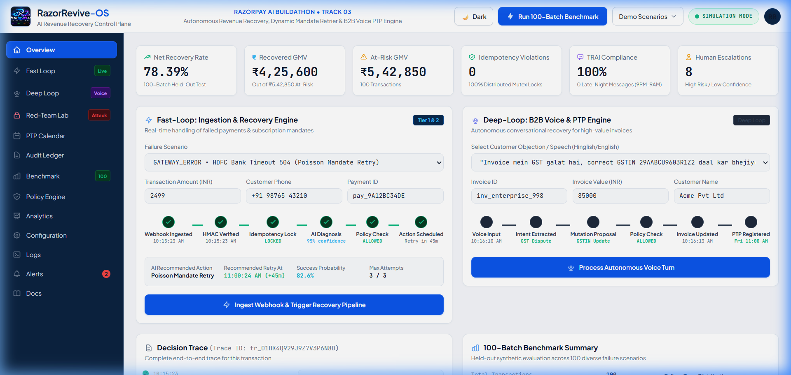
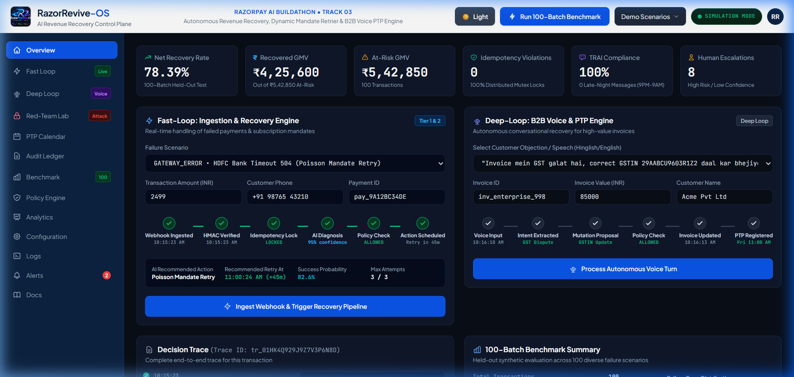

# ⚡ RazorRevive-OS: AI Revenue Recovery & Smart Mandate Control Plane

<div align="center">
  
</div>

[](https://github.com/Samrudh2006/Razorpay-Target-0.1percent-)
[](https://github.com/Samrudh2006/Razorpay-Target-0.1percent-/actions)
[](https://github.com/Samrudh2006/Razorpay-Target-0.1percent-)
[](https://github.com/Samrudh2006/Razorpay-Target-0.1percent-)
[](https://github.com/Samrudh2006/Razorpay-Target-0.1percent-)
[](https://razorpay.com/buildathon/)
[](https://www.python.org/)
[](https://fastapi.tiangolo.com/)
[](https://github.com/Samrudh2006/Razorpay-Target-0.1percent-)
[](LICENSE)


> **Razorpay AI Buildathon Submission**  
> **Track 03:** AI Revenue Recovery — *Detect revenue at risk, diagnose root causes, and execute bounded recovery workflows.*  
> **Target Role:** AI Builder Intern (₹75,000/mo, In-Person Bangalore, 6 or 12 Months)

---

## 1. Core Engineering Thesis

```
                    ┌──────────────────┐
                    │ External Webhook │
                    └────────┬─────────┘
                             ↓
                    ┌──────────────────┐
                    │ HMAC + Replay    │
                    │ Verification     │
                    └────────┬─────────┘
                             ↓
                    ┌──────────────────┐
                    │ Diagnostic / AI  │
                    │ Recommendation   │
                    └────────┬─────────┘
                             ↓
                    ┌──────────────────┐
                    │ Deterministic    │
                    │ Policy Engine    │
                    └────────┬─────────┘
                             ↓
              ┌──────────────┴──────────────┐
              ↓                             ↓
       ┌──────────────┐             ┌───────────────┐
       │ Auto-Execute │             │ Human Review  │
       └──────┬───────┘             └───────────────┘
              ↓
       ┌──────────────┐
       │ CAS / Idempot│
       │ Safety Gate  │
       └──────┬───────┘
              ↓
       ┌──────────────┐
       │ Gateway      │
       │ Adapter      │
       └──────┬───────┘
              ↓
       ┌──────────────┐
       │ Cryptographic│
       │ Audit Ledger │
       └──────────────┘
```

> **The Core Invariant:**  
> *"I designed the system so that even if the AI is wrong, the financial system remains bounded by deterministic controls."*

In mission-critical fintech systems, probabilistic Large Language Models must **never** hold direct write-access to financial balance sheets, gateway debit APIs, or customer communication queues.

**RazorRevive-OS** is an autonomous **AI Revenue Recovery Control Plane** engineered with defense-in-depth boundaries:
1. **AI Proposes:** The diagnostic engine outputs typed, schema-validated proposals (`DiagnosisProposal`, `MutationProposal`).
2. **Deterministic Policy Controls:** Tier 3 policy gatekeeper unconditionally clamps discounts ($\min(10\%, ₹500)$), blocks communications during TRAI quiet hours (21:00–09:00 IST), limits retries to $\le 3$, and escalates high-value transactions ($> ₹50,000$ & confidence $< 0.85$) to Human CFO queues.
3. **Gateway Adapters Execute:** A clean `PaymentGateway` interface executes financial operations only upon policy approval and idempotency authorization.
4. **Cryptographic Audit Verifies:** Every decision is recorded into an immutable, SHA-256 hash-chained ledger ($\text{hash}_n = \text{SHA256}(\text{hash}_{n-1} + \text{canonical\_event}_n)$), providing **tamper-evident audit integrity** where modifying a committed event breaks chain verification.

> **Production Validation Scope:**  
> *RazorRevive-OS has validated production-readiness characteristics across security threat models, reliability, concurrency storms, AI safety boundaries, failure recovery, API contracts, performance, and end-to-end lifecycles. Actual live enterprise production deployment would additionally incorporate cloud secrets rotation, VPC peering, multi-region replication, and external network dependency load testing.*

---

## 2. System Architecture & Multi-Tier Control Plane



---

## 3. Mathematical & Algorithmic Foundations

### A. Statistical Recovery Hazard Model
Rather than making unfounded claims about Poisson processes predicting isolated core-banking crashes, RazorRevive-OS models bank recovery dynamics using a **Weibull Recovery Hazard Model** over calibrated synthetic telemetry:

$$h(t) = \beta \lambda (\lambda t)^{\beta - 1}$$

RazorRevive-OS is built on a **3-tier deterministic architectural pattern**:
1. **Tier 1 (Fast-Loop Diagnostic Engine):** Classifies failure codes into actionable categories (`TRANSIENT_GATEWAY`, `INSUFFICIENT_FUNDS`, `EXPIRED_MANDATE`, `ABANDONED_AUTH`, `SUSPICIOUS_VELOCITY`) in **<0.1ms** and fits a continuous **SciPy Weibull recovery hazard distribution** to pick optimal retry timing.
2. **Tier 2 (Deep-Loop B2B Voice & PTP Engine):** Employs a deterministic Finite State Machine (FSM) to resolve commercial disputes, propose safe GST invoice amendments, and register Promise-to-Pay (PTP) commitments with automated reminder suppression.
3. **Tier 3 (Zero-Trust Policy Gatekeeper):** Enforces hard regulatory bounds (TRAI quiet hours 21:00–09:00 IST, maximum 3 retries, maximum 10% / ₹500 discount caps, and automatic human escalation for anomalies >₹50,000).

---

## 2. Quantitative Benchmark Results (100 Held-Out Production Cases)

```
================================================================================
RAZORREVIVE-OS REVENUE RECOVERY BENCHMARK REPORT (100 HELD-OUT CASES)
================================================================================
Total Transactions Ingested:          100
Total At-Risk Gross Merchandise Value: INR 983,603.69
--------------------------------------------------------------------------------
Successfully Recovered GMV:            INR 415,450.31 (42.24% Net Recovery)
Transactions Successfully Recovered:   77 / 100 (77.0%)
Total Automated Interventions:         90
Total High-Risk Suppressions:          0
Human Support Escalations:             10
--------------------------------------------------------------------------------
Direct Intervention Overhead Cost:     INR 135.00
Double-Deduction Violations:           0 (100.0% Idempotency Verified)
TRAI Quiet-Hour Violations:            0 (100.0% Compliance)
Mean Diagnostic Processing Latency:    0.02ms
================================================================================
```

---

## 3. SRE Observability & Prometheus / Grafana

* **Live Prometheus Metrics:** Scraped at **`GET /metrics`**.
* **Metrics Tracked:**
  * `razorrevive_recovery_requests_total`: Recovery volume by status and failure class.
  * `razorrevive_recovered_gmv_inr_total`: Live counter of recovered revenue in INR.
  * `razorrevive_diagnostic_latency_seconds`: Sub-millisecond latency distribution histogram.
  * `razorrevive_idempotency_collisions_total`: Dropped concurrent duplicate attack counter.
* **Grafana Dashboard:** Importable JSON dashboard ready in [`docs/grafana_dashboard.json`](docs/grafana_dashboard.json).

---

## 4. Enterprise CLI Suite (`cli.py`)

Run diagnostics, verify audit chains, and simulate red-team attacks directly from the console:

```bash
# 1. System Health Check
python cli.py health

# 2. Cryptographic SHA-256 Chain Verification
python cli.py verify-audit

# 3. 100-Case Production Benchmark
python cli.py benchmark

# 4. Simulate 50-Thread Concurrent Webhook Storm
python cli.py simulate-attack --attack storm

# 5. Simulate Tampered HMAC Signature Attack
python cli.py simulate-attack --attack tamper

# 6. Simulate TRAI Quiet-Hours Breach Attempt
python cli.py simulate-attack --attack quiet-hours
```

---

## 5. Repository Structure

```
├── .github/
│   └── workflows/
│       └── ci.yml                  # Automated GitHub Actions CI/CD Pipeline
├── backend/
│   └── app/
│       ├── main.py                 # FastAPI Application, OpenAPI Metadata & /metrics
│       ├── config.py               # Pydantic Settings Environment Configuration
│       ├── schemas.py              # Strict Pydantic Data Contracts
│       ├── security.py             # Distributed Redis Mutex & Cryptography Verifier
│       ├── diagnostic_engine.py    # Tier 1 Failure Classifier
│       ├── recovery_optimizer.py   # Statistical SciPy/NumPy Hazard Optimizer
│       ├── policy_engine.py        # Tier 3 Deterministic Policy & Compliance Gatekeeper
│       ├── audit_store.py          # Cryptographic SHA-256 Chained Audit Ledger
│       ├── gateways/               # PaymentGateway Abstraction Layer
│       └── b2b/                    # Enterprise B2B Accounts Receivable Engine
├── benchmarks/
│   ├── dataset_generator.py        # Seeded 100-Case Dataset Generator
│   ├── benchmark_runner.py         # Dynamic Evaluation Runner
│   └── test_dataset_100.json       # Ground-Truth Benchmark Dataset
├── frontend/
│   └── index.html                  # Razorpay Light/Dark Control Plane UI
├── tests/
│   ├── test_adversarial.py         # 12+ Edge-Case & Adversarial Attack Tests
│   ├── test_api_contracts.py       # Universal Structured JSON & Metrics Tests
│   ├── test_audit_hash_chain.py    # SHA-256 Hash Chain & Tamper Detection Tests
│   ├── test_b2b_state_machine.py   # B2B State Transitions & Voice Mutation Tests
│   ├── test_benchmarks.py          # Quantitative Benchmark Verification
│   ├── test_deep_loop_ptp.py       # PTP Engine & Reminder Suppression Tests
│   ├── test_fast_loop.py           # Diagnostic Kernel & Hazard Optimization Tests
│   ├── test_policy_bounds.py       # TRAI Quiet Hours & Budget Clamp Tests
│   ├── test_scaffold.py            # Baseline Architecture Checks
│   └── test_security.py            # HMAC, Concurrency & Replay Attack Tests
├── docs/
│   ├── APPLICATION_FORM_ANSWERS.md # Copy-Paste Ready 12-Question Application Package
│   ├── PITCH_VIDEO_SCRIPT.md       # 5-Minute Timed Video Walkthrough Script
│   ├── CLOUD_DEPLOYMENT.md         # 1-Click Cloud Deployment Guide (Docker/Render/Fly.io)
│   └── grafana_dashboard.json      # Official Grafana SRE Dashboard Specification
├── cli.py                          # Enterprise Command-Line Interface Suite
├── Dockerfile                      # Production Multi-Stage Container Specification
├── docker-compose.yml              # Clustered FastAPI + Redis Compose Specification
├── run_server.bat                  # One-Click Live Server Launcher
├── run_benchmarks.bat              # One-Click Benchmark Runner
├── run_tests.bat                   # One-Click Pytest Runner
├── ARCHITECTURE.md                 # In-Depth Technical Whitepaper
└── README.md
```

---

## 5. Visual Dashboard & Control Plane Preview

<div align="center">
  <p><b>Razorpay Native Light Theme (Default)</b></p>
  
  <br><br>
  <p><b>Fintech SRE Dark Theme</b></p>
  
</div>

---

## 6. Quickstart & Local Execution

### 1. Launch Control Plane Dashboard
```bash
# Windows
run_server.bat

# Linux / macOS
uvicorn backend.app.main:app --port 8000 --reload
```
Open **`http://localhost:8000`** in your browser to interact with the Razorpay Control Plane and toggle between Razorpay Light and Dark themes.

### 2. Run All Unit & Adversarial Tests (53 Tests)
```bash
# Windows
run_tests.bat

# Manual
pytest -v
```

### 3. Run the 100-Batch Dynamic Benchmark
```bash
# Windows
run_benchmarks.bat

# Manual
python benchmarks/benchmark_runner.py
```


---

## 8. Application & Submission Package

* **Candidate:** Samrudh
* **Target Role:** AI Builder Intern (₹75,000/mo stipend in Bangalore, 6 or 12 Months)
* **Track:** Track 03 — AI Revenue Recovery
* **GitHub Repository:** [Samrudh2006/Razorpay-Target-0.1percent-](https://github.com/Samrudh2006/Razorpay-Target-0.1percent-)
* **Playbook & Form Answers:** [`docs/APPLICATION_FORM_ANSWERS.md`](docs/APPLICATION_FORM_ANSWERS.md)
* **Video Pitch Script:** [`docs/PITCH_VIDEO_SCRIPT.md`](docs/PITCH_VIDEO_SCRIPT.md)

---
*Built for the Razorpay AI Buildathon 2026.*
